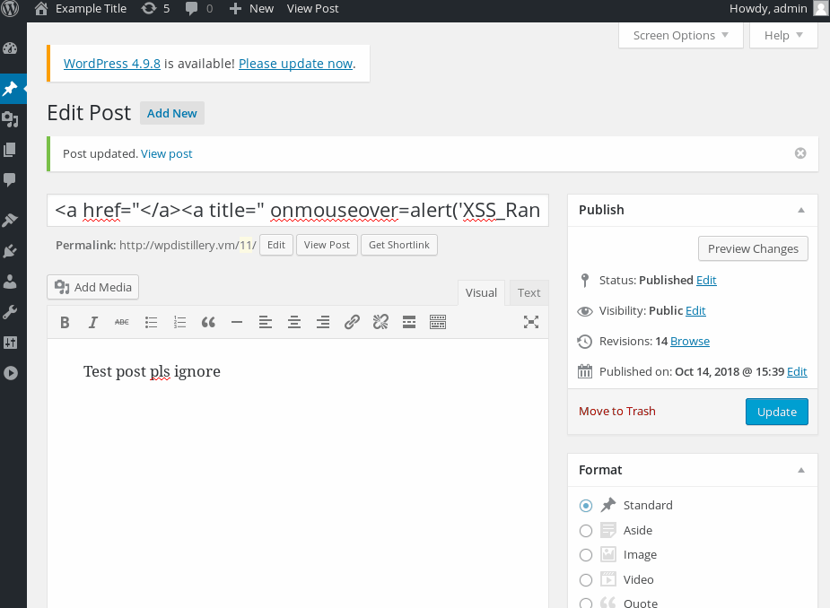
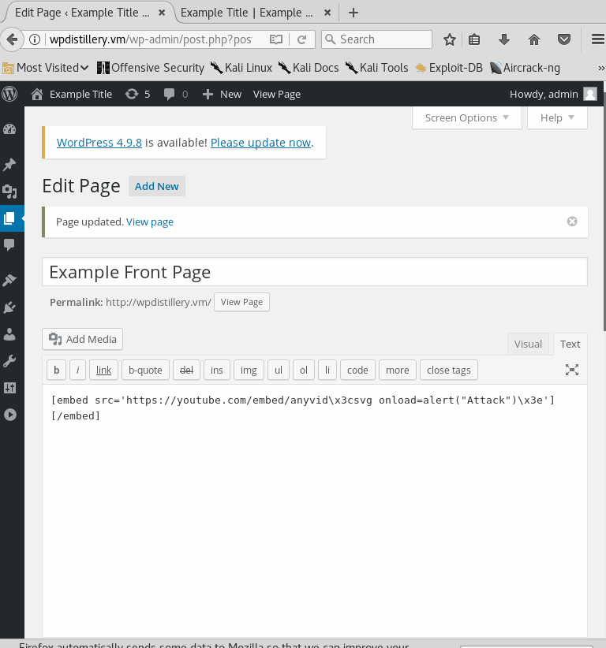
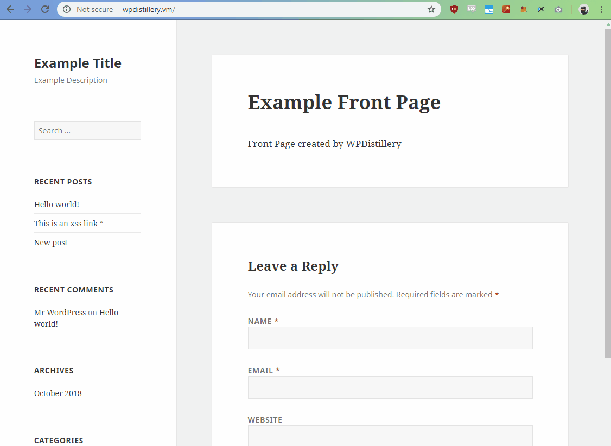
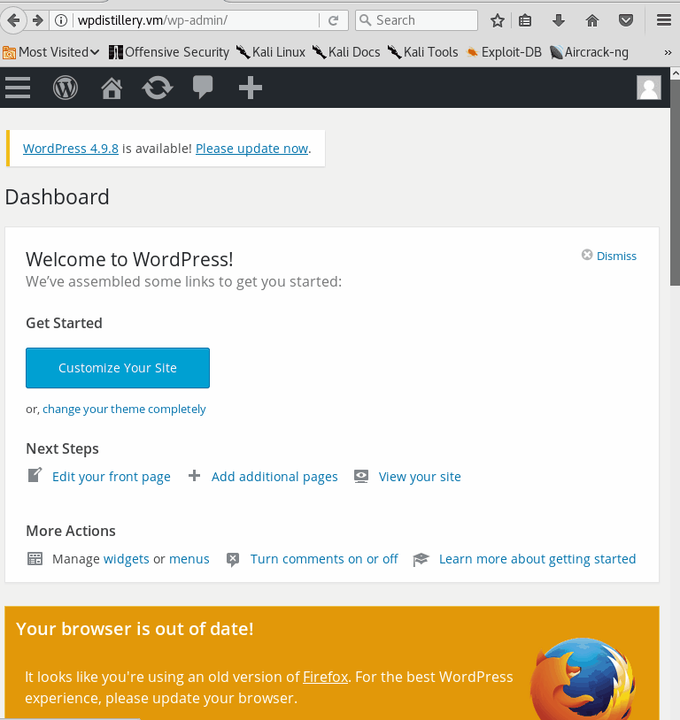

# Project 7 - WordPress Pentesting

Time spent: **7.5** hours spent in total

> Objective: Find, analyze, recreate, and document **five vulnerabilities** affecting an old version of WordPress

## Pentesting Report

1. Authenitcated Stored Cross Site Scripting
  - [ ] Summary:  A simple alert script is ran whenever the user mouses over or clicks the targeted link.
    - Vulnerability types: XSS
    - Tested in version: 4.2
    - Fixed in version: 4.2.3
  - [ ] GIF Walkthrough: 
  - [ ] Steps to recreate: Create a new post with the following as the title: `javascript <a href="</a><a title=" onmouseover=alert('XSS_Ran')  ">This is an xss link</a> "` or `<a href="</a><a title=" onclick=alert('XSS_Ran')  ">This is an xss link</a> "`. Then publish the post so that is visibile on the home page.
    - [Link 1](https://wpvulndb.com/vulnerabilities/8111)
    
2. Authenticated Stored XSS in Youtube URL Embeds
  - [ ] Summary: A XSS is ran everytime the page with the script loads because the page attempts to load the embedded video on page load.
    - Vulnerability types: XSS
    - Tested in version:4.2
    - Fixed in version: 4.2.13
  - [ ] GIF Walkthrough: 
  - [ ] Steps to recreate: Make a post using the youtube embed with the url: [embed src='https://youtube.com/embed/anyvid onload=alert("Attack")'][/embed]
  - [ ] Affected source code: 
    - [Link 1](https://cve.mitre.org/cgi-bin/cvename.cgi?name=CVE-2017-6817)
3. User Enumeration Username ID
  - [ ] Summary: The admin WP log in page indicates which usernames are known and unknown. By giving out such information, brute force attacks to extract usernames is possible. 
    - Vulnerability types: User Enumeration
    - Tested in version: 4.2
    - Fixed in version: 4.4
  - [ ] GIF Walkthrough: 
  - [ ] Steps to recreate: Type the correct username but with a wrong password and hit submit. The error message: "ERROR: The password you entered for the username admin is incorrect" will pop up indicating that this is a known user and that just the password is incorrect. Otherwise, if the username is incorrect, this error will pop up "ERROR: Invalid username." indicating that is not a known user. 
    - [Link 1](https://hackertarget.com/wordpress-user-enumeration/)
4. Authenticated Stored Cross-Site Scripting via Image Filename
  - [ ] Summary: Improper handling of the filename for media uploads causes scripts withing the file name to be run.
    - Vulnerability types: XSS
    - Tested in version: 4.2
    - Fixed in version: 4.2.10
  - [ ] GIF Walkthrough: 
  - [ ] Steps to recreate: Upload an image with javascript in the file name (ex. `ammozilla.jpg`) Then embed or view the image in the gallery.
  - [ ] Affected source code: media.php
    - [Link 1](https://wpvulndb.com/vulnerabilities/8615)
 

## Assets
N/A

## Resources

- [WordPress Source Browser](https://core.trac.wordpress.org/browser/)
- [WordPress Developer Reference](https://developer.wordpress.org/reference/)

GIFs created with [ScreenToGif](http://www.screentogif.com).

## Notes

Exploiting these vulnerabilities involved a lot of trial and error, which was to be expected. 

## License

    Copyright [2018] [Alan Liu]

    Licensed under the Apache License, Version 2.0 (the "License");
    you may not use this file except in compliance with the License.
    You may obtain a copy of the License at

        http://www.apache.org/licenses/LICENSE-2.0

    Unless required by applicable law or agreed to in writing, software
    distributed under the License is distributed on an "AS IS" BASIS,
    WITHOUT WARRANTIES OR CONDITIONS OF ANY KIND, either express or implied.
    See the License for the specific language governing permissions and
    limitations under the License.
